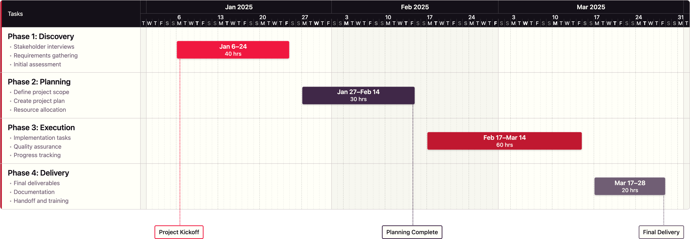

# GanttGen

A data-driven Gantt chart generator with brand color palettes, configurable tasks, milestones, and pause periods. Generates presentation-ready HTML and PNG outputs.

## Features

- 🎨 **Brand Color Palettes** - Multiple preset palettes (reds, purples, alternating) with accent options
- 📊 **Data-Driven** - Configure via JSON or Excel templates
- 🎯 **Milestones** - Automatic connector lines with smart positioning
- ⏸️ **Pause Periods** - Visual breaks with diagonal stripe pattern
- 📸 **PNG Export** - High-resolution transparent background for presentations
- 📐 **Presentation Ready** - Optimized for 16:9 aspect ratio (1920×1080)

---

## Example Output



*Example Gantt chart using the `alternating_b` palette - see [Palette Examples](palette_examples/PALETTE_EXAMPLES.md) for all variants*

---

## Quick Start

```bash
# Install dependencies
npm install

# Generate chart from template
node scripts/build.js --input templates/gantt_template.json --palette alternating

# Generate with specific palette
node scripts/build.js --input input/myproject.json --palette purples_c
```

---

## Project Structure

```
GanttGen/
├── templates/
│   ├── gantt_template.html    # HTML/CSS/JS rendering template
│   ├── gantt_template.json    # JSON data template (copy to input/)
│   └── gantt_template.xlsx    # Excel data template (copy to input/)
├── scripts/
│   ├── build.js               # Main build script
│   ├── json_to_excel.js       # Convert JSON → Excel
│   ├── render.js              # Legacy render script
│   └── generate_template.js   # Excel template generator
├── input/                     # Your project files (gitignored)
├── output/                    # Generated charts (gitignored)
├── config/                    # Build artifacts (gitignored)
└── package.json
```

---

## Usage

### CLI Options

```bash
node scripts/build.js --input <file> [options]

Options:
  --input, -i     Input file (JSON or XLSX) [required]
  --output, -o    Output HTML file (defaults to output/<name>_gantt_chart.html)
  --palette, -p   Color palette preset (see below)
```

### Input Formats

**Option A: JSON** (Recommended for version control)
```bash
node scripts/build.js -i input/project.json -p alternating
```

**Option B: Excel** (Recommended for non-technical users)
```bash
node scripts/build.js -i input/project.xlsx -p reds_b
```

### Output

Each build generates:
- `output/<name>_gantt_chart_<palette>.html` - Interactive HTML preview
- `output/<name>_gantt_chart_<palette>.png` - High-res PNG (transparent background)

---

## Color Palettes

> 📸 **See [Palette Examples](palette_examples/PALETTE_EXAMPLES.md) for visual comparisons of all palette variants**

### Brand Colors

| Category | Name | Hex | RGB |
|----------|------|-----|-----|
| **Reds** | RED 1 | `#F01840` | 240/24/64 |
| | RED 2 | `#C01830` | 192/24/48 |
| | RED 3 | `#901226` | 144/18/38 |
| | RED 4 | `#600C1C` | 96/12/28 |
| | RED 5 | `#300810` | 48/8/16 |
| **Purples** | PURPLE 1 | `#D0C8C8` | 208/200/200 |
| | PURPLE 2 | `#A0949E` | 160/148/158 |
| | PURPLE 3 | `#705E74` | 112/94/116 |
| | PURPLE 4 | `#402848` | 64/40/72 |
| | PURPLE 5 | `#2A1C30` | 42/28/48 |
| **Neutrals** | CREAM | `#FFFFF8` | 255/255/248 |
| | BLACK | `#141018` | 20/16/24 |

### Palette Presets

| Preset | Task Colors | Accent | Description |
|--------|-------------|--------|-------------|
| `reds` | RED 1 → RED 5 | — | Warm red gradient |
| `reds_a` | RED 1 → RED 5 | — | Same as reds |
| `reds_b` | RED 1 → RED 5 | Purple left border | Red bars + purple accent edge |
| `purples_a` | PURPLE 3 → PURPLE 5 | Burgundy task names | Purple bars + red text |
| `purples_b` | PURPLE 3 → PURPLE 5 | Red left border | Purple bars + red accent edge |
| `purples_c` | PURPLE 3 → PURPLE 5 | Both text + border | Purple bars + full red accent |
| `alternating` | RED/PURPLE mix | — | Maximum visual distinction *(default)* |
| `alternating_b` | RED/PURPLE mix | Red left border | Maximum distinction + brand accent |

### Usage Examples

```bash
# Warm, attention-grabbing red gradient
node scripts/build.js -i input/project.json -p reds

# Sophisticated purple with burgundy task headers
node scripts/build.js -i input/project.json -p purples_a

# Purple bars with red left border accent
node scripts/build.js -i input/project.json -p purples_b

# Purple bars with both burgundy text AND red border
node scripts/build.js -i input/project.json -p purples_c

# Red bars with purple left border accent
node scripts/build.js -i input/project.json -p reds_b

# Alternating red/purple for best task differentiation (default)
node scripts/build.js -i input/project.json -p alternating

# Alternating red/purple with red left border accent
node scripts/build.js -i input/project.json -p alternating_b
```

---

## Configuration Schema

### JSON Structure

```json
{
  "title": "PROJECT TIMELINE",
  "timelineStart": "2025-01-01",
  "timelineEnd": "2025-03-31",
  "showMilestones": true,
  "palette": [
    "#F01840", "#402848", "#C01830",
    "#705E74", "#901226", "#2A1C30"
  ],
  "tasks": [...],
  "milestones": [...],
  "pausePeriods": [...]
}
```

### Tasks

| Field | Type | Required | Description |
|-------|------|----------|-------------|
| `name` | string | ✅ | Task display name |
| `start` | string | ✅ | Start date (YYYY-MM-DD) |
| `end` | string | ✅ | End date (YYYY-MM-DD) |
| `hours` | number | | Estimated hours |
| `subtasks` | array | | Array of subtask descriptions |
| `colorIndex` | number | | Index into palette array |
| `color` | string | | Direct hex color (overrides colorIndex) |

```json
{
  "name": "Phase 1: Discovery",
  "start": "2025-01-06",
  "end": "2025-01-24",
  "hours": 40,
  "subtasks": [
    "Stakeholder interviews",
    "Requirements gathering"
  ],
  "colorIndex": 0
}
```

### Milestones

| Field | Type | Required | Description |
|-------|------|----------|-------------|
| `name` | string | ✅ | Milestone label (use `\n` for line breaks) |
| `date` | string | ✅ | Milestone date (YYYY-MM-DD) |
| `taskIndex` | number | | Index of associated task (for connector color) |

```json
{
  "name": "Project Kickoff",
  "date": "2025-01-06",
  "taskIndex": 0
}
```

### Pause Periods

| Field | Type | Required | Description |
|-------|------|----------|-------------|
| `start` | string | ✅ | Pause start date (YYYY-MM-DD) |
| `end` | string | ✅ | Pause end date (YYYY-MM-DD) |

```json
{
  "start": "2025-12-23",
  "end": "2026-01-04"
}
```

Tasks spanning pause periods automatically show a diagonal stripe break effect.

---

## Excel Template

The Excel template (`templates/gantt_template.xlsx`) contains sheets:

| Sheet | Purpose |
|-------|---------|
| **Palette** | Color definitions (hex codes) |
| **Project** | Title, timeline dates, settings |
| **Tasks** | Task definitions with subtasks |
| **Milestones** | Milestone definitions with task linking |
| **PausePeriods** | Break periods |

### Workflow

1. Copy template to `input/` folder
2. Fill in your project data
3. Run build with palette override:
   ```bash
   node scripts/build.js -i input/myproject.xlsx -p alternating
   ```

### Convert JSON ↔ Excel

```bash
# JSON to Excel
node scripts/json_to_excel.js -i input/project.json -o input/project.xlsx

# Excel to JSON (happens automatically during build)
```

---

## npm Scripts

| Command | Description |
|---------|-------------|
| `npm run build` | Build from `config/project.json` |
| `npm run template` | Generate Excel template |
| `npm run render` | Legacy render script |

---

## Dependencies

| Package | Purpose |
|---------|---------|
| `exceljs` | Excel file parsing/generation |
| `puppeteer` | PNG export (optional, uses system Chrome) |

```bash
# Install all dependencies
npm install

# Puppeteer is optional - PNG export uses system Chrome/Edge if available
```

---

## Examples

### Generate All Palette Variants

```bash
for p in reds reds_b purples_a purples_b purples_c alternating; do
  node scripts/build.js -i input/project.json -p $p
done
```

### Custom Output Location

```bash
node scripts/build.js \
  --input input/client_project.json \
  --output presentations/q1_timeline.html \
  --palette purples_c
```

---

## Tips

1. **For presentations**: Use PNG output with transparent background
2. **For differentiation**: Use `alternating` palette (red/purple mix)
3. **For sophistication**: Use `purples_c` with both accent styles
4. **For urgency/energy**: Use `reds` or `reds_b` palette
5. **Pause periods**: Great for holidays, client review periods, etc.

---

## License

ISC
