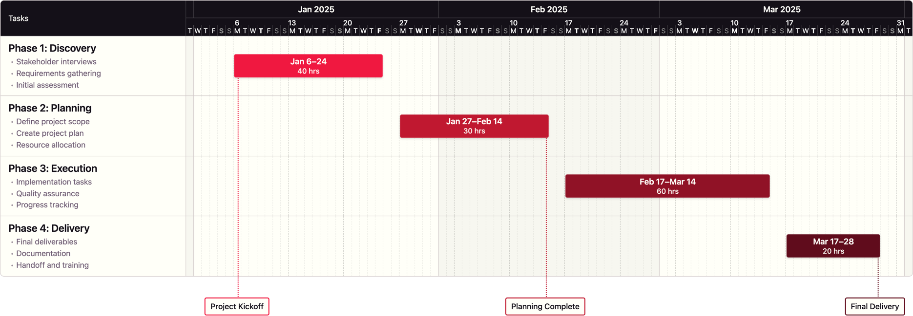
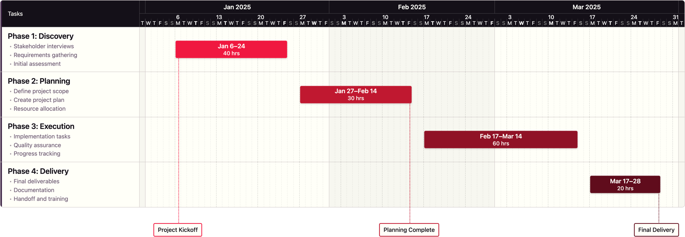
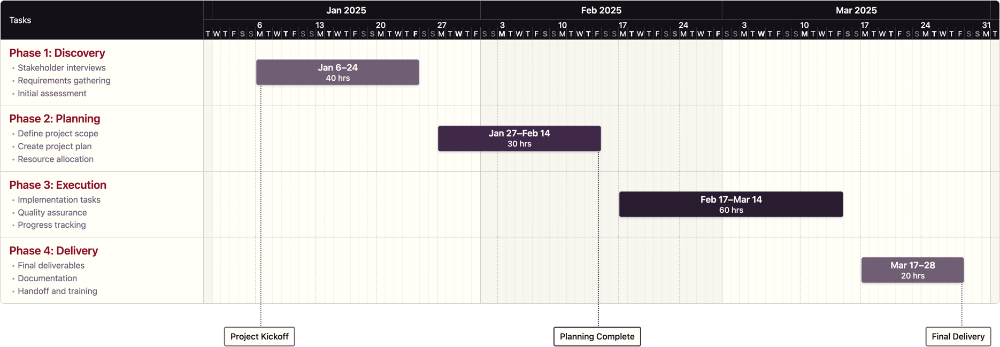
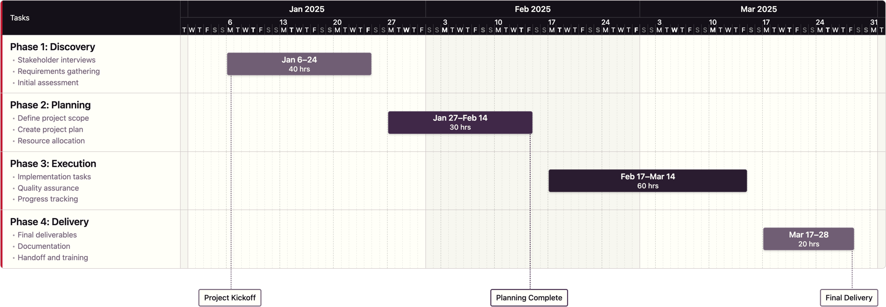
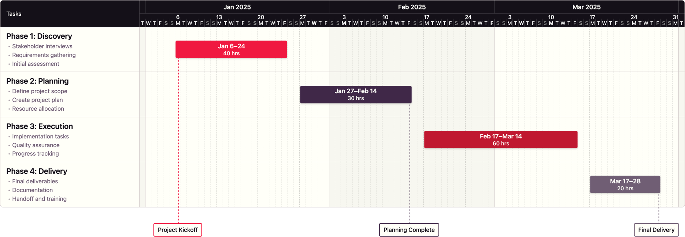

# Gantt Chart Palette Examples

This page showcases all available color palette presets for GanttGen. Each palette is rendered from the template project to demonstrate the visual differences.

---

## Reds Palette

**Command:**
```bash
node scripts/build.js --input templates/gantt_template.json --palette reds
```

**Description:** Warm red gradient from bright red (RED 1) to very dark burgundy (RED 5). Perfect for attention-grabbing, energetic projects.



---

## Reds B Palette

**Command:**
```bash
node scripts/build.js --input templates/gantt_template.json --palette reds_b
```

**Description:** Red gradient task bars with a purple left border accent. Combines the warmth of red with a sophisticated purple edge accent.



---

## Purples A Palette

**Command:**
```bash
node scripts/build.js --input templates/gantt_template.json --palette purples_a
```

**Description:** Sophisticated purple gradient with burgundy task name text. Muted purple bars with red accent on task headers for brand cohesion.



---

## Purples B Palette

**Command:**
```bash
node scripts/build.js --input templates/gantt_template.json --palette purples_b
```

**Description:** Purple gradient task bars with red left border accent. Keeps task names in black while adding a red accent edge.



---

## Purples C Palette

**Command:**
```bash
node scripts/build.js --input templates/gantt_template.json --palette purples_c
```

**Description:** Purple gradient with both burgundy task name text AND red left border accent. Maximum brand color integration.


---

## Alternating Palette

**Command:**
```bash
node scripts/build.js --input templates/gantt_template.json --palette alternating
```

**Description:** Alternating red and purple task bars for maximum visual distinction between adjacent tasks. Default palette for best differentiation.



---

## Alternating B Palette

**Command:**
```bash
node scripts/build.js --input templates/gantt_template.json --palette alternating_b
```

**Description:** Alternating red and purple task bars with red left border accent. Combines maximum visual distinction with brand accent styling.


---

## Palette Comparison

| Palette | Task Colors | Accent Style | Best For |
|---------|-------------|--------------|----------|
| `reds` | RED 1 → RED 5 | None | Energetic, urgent projects |
| `reds_b` | RED 1 → RED 5 | Purple left border | Red with brand accent |
| `purples_a` | PURPLE 3 → PURPLE 5 | Burgundy task names | Sophisticated with subtle accent |
| `purples_b` | PURPLE 3 → PURPLE 5 | Red left border | Purple with edge accent |
| `purples_c` | PURPLE 3 → PURPLE 5 | Both text + border | Maximum brand integration |
| `alternating` | RED/PURPLE mix | None | Best task differentiation |
| `alternating_b` | RED/PURPLE mix | Red left border | Best differentiation + brand accent |

---

## Usage Tips

- **For presentations:** Use PNG output with transparent background
- **For maximum differentiation:** Use `alternating` palette
- **For sophistication:** Use `purples_c` with both accent styles
- **For urgency/energy:** Use `reds` or `reds_b` palette
- **For brand consistency:** Use any `purples_*` variant with red accents

